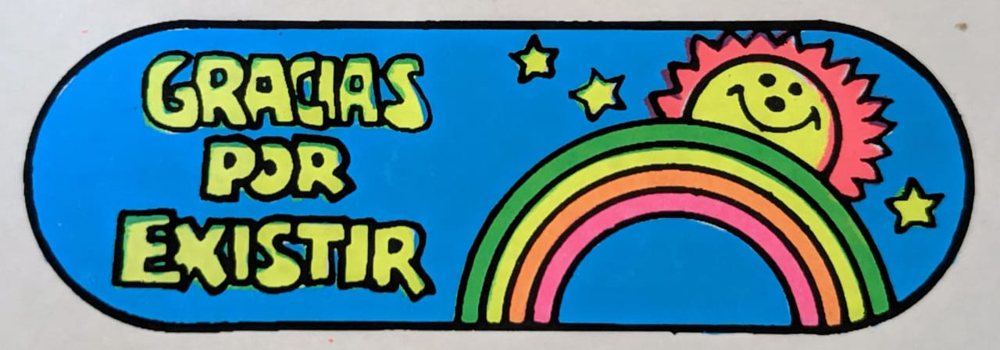

# Eduardo Perez Infante

## Perfil

**Disciplina / formación:**  Arquitecto, Estudios de las Comunicaciones

**Qué hago hoy:**  Administración, producción técnica
**Qué me gustaría aprender en este curso:**  Visualizar y compartir data, integrar data como parametros de diseño

## Intereses

- Arquitectura, y dimension performativa del diseño.
- El Juego como fenómeno social y como entrada al diseño
- Deportes, ciclismo, natacion, tenis


## Una pregunta que me interesa explorar

Escribe una pregunta pequeña que pueda transformarse en reglas, datos, geometría, imágenes o interacción.

## Algo que me inspira

Agrega una imagen local en `assets/images/` y cítala con Markdown, o agrega un link a un proyecto/referencia.


```md

```

## Links

- [Referencia 1](https://example.com)
- [Referencia 2](https://example.com)

> No es necesario publicar información personal que no quieras compartir. Este README será parte de un repositorio público durante el laboratorio.
