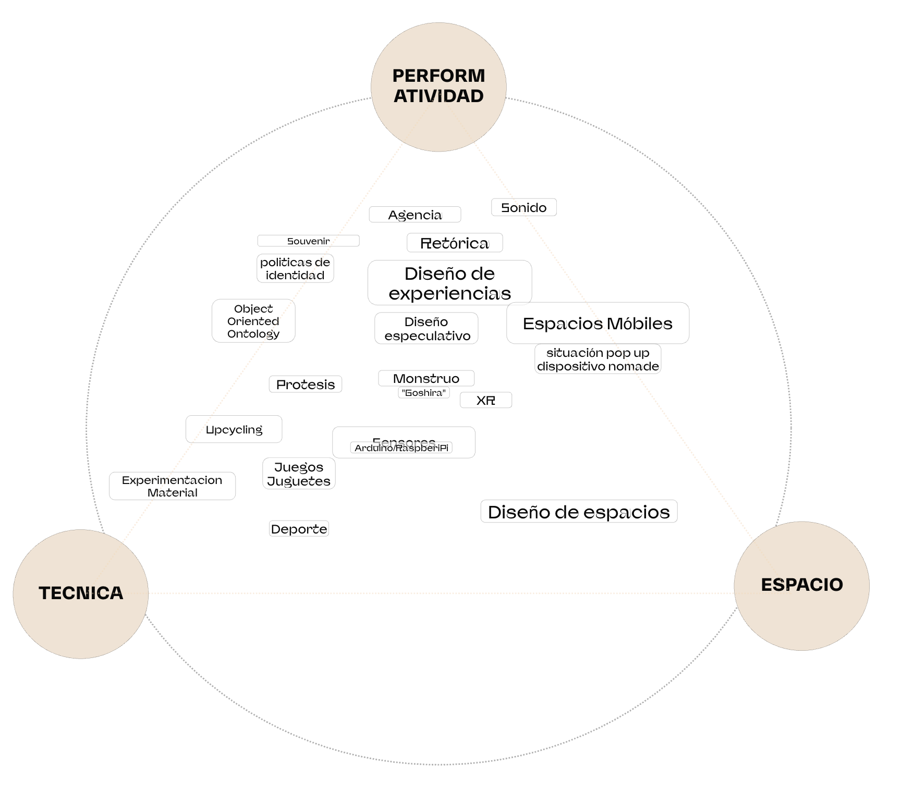

# Eduardo Perez Infante

## Perfil

**Disciplina / formación:**  Arquitecto, Estudios de las Comunicaciones. 
**Qué hago hoy:** Producción Técnica y Artística, Administración.
**Qué me gustaría aprender en este curso:**  Expandir mi comprensión de lo que es un artefacto de diseño.  Me interesa la capacidad que estas herramientas tienen para capturar fenómenos  y producir sistemas de respuesta. 


## Intereses

- Dimensión performativa del diseño
- Ciclismo, natacion, tenis. Me gusta la práctica de estos deportes y me interesa la métrica deportiva.
- El Juego como fenómeno cultural y como entrada al diseño
- Comportamiento humano, neurociencia, biohacking

```md


## Links


## Una pregunta que me interesa explorar

Qué artefactos de diseño nos permiten sensar, visualizar y comprender un fenómeno fisiológico complejo como lo es la respuesta ante el estrés o el dolor emocional. 
En el contexto temático del duelo animal, qué posibles respuestas permiten las herramientas de computación avanzada en su capacidad para generar sistemas en base a datos. 
Puede esta capacidad de sensabilidad y responsibilidad contruibuir a un diseño sensible y responsable?


## Algo que me inspira


```md


- [Nuropod](https://nuropod.com/es)

## Links

- [Referencia 1](https://perezinfante.com/)
- [Referencia 2](https://www.instagram.com/_kite_club_/)

